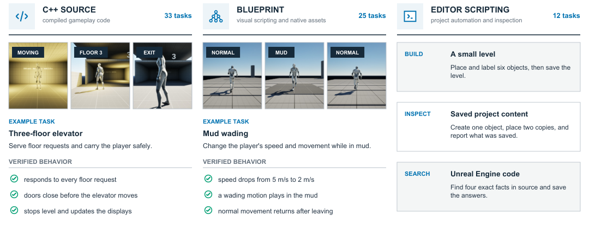

<div align="center">

# CraftBench-UE

**Deterministic evaluation of AI coding agents in Unreal Engine 5.8.**

[](https://arxiv.org/abs/2609.23142)
[](https://www.unrealengine.com/)
[](https://www.python.org/)
[](https://github.com/ramenvr/craftbench-ue/actions/workflows/unit-tests.yml)

</div>

CraftBench-UE hands an AI coding agent a real Unreal Engine 5.8 project and a plain-English
description of a gameplay feature — *"make a guard light its lamp red exactly while it can see
the character the player controls"* — and then checks whether the game actually does that.

Checking means playing it. The harness compiles the project with UnrealBuildTool, launches it
headless in Play-In-Editor, drives the running game with scripted test fixtures, and inspects the
assets that were built. **No language model decides PASS or FAIL.** Grade the same submission
twice and you get the same answer; when it fails, the reason is a build error or a measured value
at a named moment of play.

The prompt never says *how*. It names no class, plugin or pattern, there is no answer key, and
the agent never sees the tests it will be graded by.

The benchmark — and a study of seven models across two editor-tool configurations — is described
in the paper: [**CraftBench-UE: Deterministic Evaluation for Coding Agents in Unreal
Engine**](https://arxiv.org/abs/2609.23142) (Wu, Calderone & Tsen, arXiv:2609.23142).



<sub>The three kinds of deliverable a task can ask for, and the paper's 70-task benchmark split
across them. C++ and Blueprint tasks are graded on behaviour in a running game; editor-scripting
tasks on the project state they leave behind. This repository ships **117** tasks — those 70,
plus 47 more in `tasks/craftbench-public/` written to the same bar but outside the study. No run
records ship here.</sub>

## Quick start

Needs **UE 5.8** and **Python 3.11+**. The grading path needs no API key at all.

```sh
git clone -c core.longpaths=true https://github.com/ramenvr/craftbench-ue.git craftbench-ue
cd craftbench-ue

.\setup.cmd                                      # Windows  (./setup.sh elsewhere)
py -3.12 tools\scripts\bootstrap_substrate.py    # restore Epic template content — required once

cb smoke                                         # preflight + unit tests + one real graded task
```

Then grade a known-good solution, token-free, no agent involved:

```sh
cb batch-eval --references all     # grade every committed reference solution
```

Or point an agent at a task and grade what it produces:

```sh
cb eval --model claude-p:<model> --task cpp/t0-sanity-log-on-beginplay
```

Full detail: [Install](#install) below, then [`docs/RUNNING.md`](docs/RUNNING.md). If
something looks wrong, `cb doctor` says what your machine is missing; Windows specifics are in
[`docs/WINDOWS.md`](docs/WINDOWS.md).

## How it works


A task ships a starting UE project, a prose instruction, and a **hidden verifier** the agent never
sees. The harness rebuilds the project from git HEAD, hands the agent the instruction and a
restricted writable area, then replays only the permitted changes onto a clean project and applies
the gates the task declares:

| Gate | What it checks |
| --- | --- |
| **L1** | UnrealBuildTool builds the Editor **and** Game targets. Both must exit 0. |
| **L2** | The project runs in headless Play-In-Editor at a fixed deterministic timestep; `AFunctionalTest` fixtures sample state at scheduled checkpoints. Actors are found **by tag**, never by class, so the agent may subclass freely. |
| **L2I** | Structural inspection of a generated `.uasset` through headless editor Python — no rendering, no model. |

Before a task is allowed to ship it must **discriminate**: the reference solution PASSes, and every
plausible wrong answer FAILs *at a different named assertion*. A FAIL for the wrong reason is not
credited. Each task's record is in its own `discrimination/MATRIX.md`, and `cb discriminate`
re-runs it.

→ **[Anatomy of a task](docs/ANATOMY-OF-A-TASK.md)** walks one task through all of this.

## What is being compared

The experimental variable is the **tool layer**, not the model: hold the reasoning model fixed,
change what the agent can *do* to the engine, grade everything with the same verifier.

| Arm | What the agent is given | Runnable here? |
| --- | --- | --- |
| `claude-p` | **Baseline.** Claude Code with its own file/shell tools and zero MCP servers. No editor access. | **Yes** |
| `unreal-mcp` | Baseline **plus Epic's in-engine MCP server**, which ships inside UE 5.8. | **Yes** |
| `bare` | **Our own** minimal agent loop over any OpenAI-compatible endpoint. No editor. | **Yes** |
| `openrouter` | The same Claude CLI harness, pointed at OpenRouter — a non-Anthropic model in an identical scaffold. | **Yes** |
| `aura-mcp` | **Only** a commercial Unreal agent product's MCP tools; file and shell access denied. | **No — disclosed, not reproducible** |

Model slugs are `<backend>[:<model>]`. A slashed model id (`unreal-mcp:openai/gpt-5`) routes the
reasoner through OpenRouter, which is how one model is held fixed across tool layers.

`aura-mcp` **ships disclosed but cannot be run from this repository**: it needs a vendor plugin,
two private services and an entitled account, none of which are ours to distribute. What *is*
published is everything that defines the arm — its adapter, its exact tool-denial list, its MCP
config — so the restriction can be audited. Results from it are not independently reproducible;
the other four arms are. See [THIRD-PARTY.md](THIRD-PARTY.md) §4.

**No run results of any kind ship in this repository, for any arm.**

## Install

| Need | Detail |
| --- | --- |
| **Unreal Engine 5.8** | Only 5.8. ~100 GB from the Epic Games Launcher; allow hours. Found automatically at the platform default, or set `CB_UE_ROOT` / pass `cb --ue-root`. |
| **Python 3.11+** | 3.12 recommended. Plus `git` and `tar` on PATH. |
| **Disk** | ~100 GB engine, ~260 MB restored into the clone, then **~6 GB per graded run**. The preflight fails under 15 GB free rather than spending anything. |
| **Memory** | Windows **commit charge** binds, not installed RAM: the gate wants 10 GB free commit and a limit of installed RAM + 25 GB, i.e. a fixed-size pagefile. A 32 GB box works with that plus a build-parallelism cap ([Configure](docs/RUNNING.md#configure)). |

**Platform honesty.** Windows + UE 5.8 is the **validated** platform and the only one CI runs.
macOS is **historical** (validated before the 5.8 pin) and Linux is **unproven**; the non-Windows
CI legs are opt-in and expected to fail.

> **Windows, at clone time.** The longest path here is 214 characters, so Git for Windows' default
> `core.longpaths=false` aborts the checkout if your clone directory is longer than ~45 characters.
> The command below passes `-c core.longpaths=true` for that reason — keep it. Already got a
> partial checkout? `git config core.longpaths true && git checkout -f`.
>
> The other Windows-only traps — the run-time `MAX_PATH` limit on `CB_ROOT`, line endings,
> quoting — are in [`docs/WINDOWS.md`](docs/WINDOWS.md). You need it when something looks wrong,
> not to get started.

```sh
git clone -c core.longpaths=true https://github.com/ramenvr/craftbench-ue.git craftbench-ue
cd craftbench-ue

# then ONE of:
.\setup.cmd         # Windows
./setup.sh          # macOS / Linux / git-bash — flags: --no-tests --json --full --strict --verbose
```

Use `setup.cmd` on a fresh Windows box — PowerShell's default execution policy blocks
`.\setup.ps1`. Setup checks prerequisites, creates `.env`, installs the `cb` console script, runs
the unit suites and `cb doctor`, then prints a readiness table with a "run now" command.

**Then restore the substrate content — required once per clone.**

```sh
py -3.12 tools\scripts\bootstrap_substrate.py     # Windows
python3 tools/scripts/bootstrap_substrate.py      # macOS / Linux / git-bash
```

The two projects under `UE-projects/` are built on Epic's stock templates, and that half of them
is Epic's, not ours to redistribute — so the script copies it (~260 MB, 881 files) out of the
engine you just installed. **Until it runs, the substrates are incomplete and a graded run fails
at the build.** Re-running is safe; `--check` verifies without writing.

You do **not** have to install `cb`: the repo-root shims (`.\cb`, `./cb`) work straight after
clone. `cb doctor` reports per-tier readiness with a fix hint per blocker, and `cb where` shows
every resolved machine directory — both free and read-only.

## Documentation

| | |
| --- | --- |
| [`docs/RUNNING.md`](docs/RUNNING.md) | Configure, run an eval, read a result, compare arms |
| [`docs/ANATOMY-OF-A-TASK.md`](docs/ANATOMY-OF-A-TASK.md) | One task end to end, and how discrimination works |
| [`docs/CHEATSHEET.md`](docs/CHEATSHEET.md) | Every command, flag and environment variable |
| [`docs/WINDOWS.md`](docs/WINDOWS.md) | Line endings, `MAX_PATH`, quoting, macOS divergences |
| [`DEVELOPING.md`](DEVELOPING.md) · [`CONTRIBUTING.md`](CONTRIBUTING.md) | Architecture and the code tour · maintainer, project status, and how to add a task or an arm |
| [`tasks/CATALOG.md`](tasks/CATALOG.md) | Every task, and what it evaluates |
| [`docs/DOCS_INDEX.md`](docs/DOCS_INDEX.md) | Map of everything else |

## Repository layout

| Path | What lives there |
| --- | --- |
| `tasks/` | 117 task specs in four sets, plus `CATALOG.md` and `PREAMBLE.md` (the prompt contract prepended to every graded run) |
| `UE-projects/` | The substrates the agent edits — `CraftBenchTemplate/` (minimal C++ scaffold) and `ThirdPerson/` (stock UE template). Both pair a writable game module with a read-only test module. Epic's content is **not** committed; `bootstrap_substrate.py` restores it |
| `tools/verify-single/` | **The verifier.** Grades one submission against one task (L1 / L2 / L2I) and owns the sandbox. Entry point `run_task.py` |
| `tools/run-agent/` | **The harness.** Picks a task and an arm, runs the agent, snapshots the edits, calls the verifier. `cb` lives in `aura_rig/`, the arms in `adapters/` |
| `tools/verify-r2/` | A firewalled advisory rubric judge — annotates reports, never gates them |
| `tools/dashboard/`, `coverage/`, `compare/` | The `report.html` renderer (stdlib only), concept coverage, and cross-run diffs |
| `docs/` | Authoring template, command cheatsheet, harness walkthrough, Windows notes |
| `cb`, `cb.cmd`, `setup.*` | Zero-install shims and one-shot setup — they work straight after clone |

## Licensing

MIT ([LICENSE](LICENSE)) — **but that grant stops at our own work.**

This repository ships no Unreal Engine content. Once you run the bootstrap step in [Install](#install), your working
tree holds Epic-owned files restored from your own licensed install: those are under the **Unreal
Engine EULA**, not ours to relicense, and MIT does not reach them.
[THIRD-PARTY.md](THIRD-PARTY.md) records exactly which files those are (§2) and the `aura-mcp`
disclosure (§4). Read it before redistributing anything out of your tree.

## Citing CraftBench-UE

If this benchmark or its harness was useful in your work, please cite the paper:

```bibtex
@misc{wu2026craftbenchue,
  title         = {{CraftBench-UE}: Deterministic Evaluation for Coding Agents in Unreal Engine},
  author        = {Wu, Shutong and Calderone, Kevin and Tsen, Andy},
  year          = {2026},
  eprint        = {2609.23142},
  archivePrefix = {arXiv},
  primaryClass  = {cs.AI},
  url           = {https://arxiv.org/abs/2609.23142}
}
```
