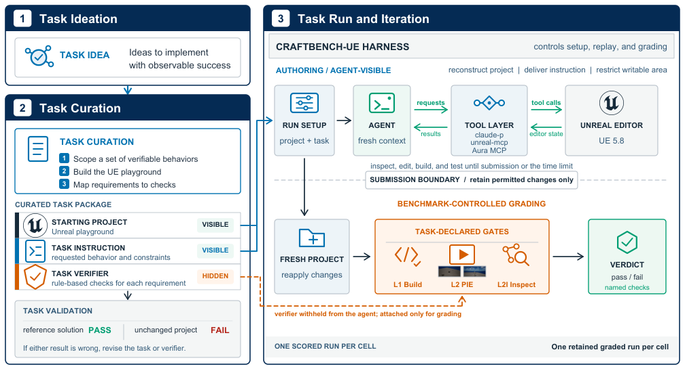

# Anatomy of a task

One task, end to end: what the agent is shown, what it is graded by, and how
the task proves it can tell a correct answer from a plausible wrong one.

For the command surface see [`CHEATSHEET.md`](CHEATSHEET.md); to write a task
of your own see [`TASK-AUTHOR-GUIDE.md`](TASK-AUTHOR-GUIDE.md).

Take `tasks/cpp/t1-movement-component-drives-actor`. On disk:

```
tasks/cpp/t1-movement-component-drives-actor/
  task.md                     # front matter (id, substrate, layers, fixtures) + the prompt
  reference/Source/...        # the maintainers' known-good solution (graded token-free)
  discrimination/             # deliberately wrong solutions that MUST fail
    MATRIX.md
    teleport-once-then-static/
    gravity-acceleration-ramp/
    spawns-tagged-proxy-mover/
```

The agent sees three things, and no part of the answer key. `tools/run-agent/prompt_extract.py`
allow-lists exactly **two** H2 sections of `task.md` — `## Prompt given to the agent` and
`## Workspace state pre-task` (which names the scaffold files that already exist) — and drops
everything else: primary concept, verifier specification, reference metadata, anti-gaming notes,
and any section a future spec adds. `run.py` prepends the third piece, the benchmark preamble
([`tasks/PREAMBLE.md`](../tasks/PREAMBLE.md)), which is the uniform prompt contract every backend
applies. The prompt half reads:

> The project contains an object placed in the level. Make it drift smoothly and continuously in
> one horizontal direction as soon as gameplay begins. It must move at a steady speed — covering
> equal distance in equal time — without accelerating, stopping, or snapping. [...] Solve in C++
> on the existing class — do not edit the level and do not edit any test file.

It works inside the *substrate* — a real UE 5.8 project (here `UE-projects/CraftBenchTemplate`) with
an agent-writable game module and a **read-only** test module. The scaffold class `ADriftActor`
already exists and sits still. The verifier then runs the layers the task declares in its `layers:`
front-matter key:

| Layer | What it does |
| --- | --- |
| **L1** | Builds the Editor **and** Game targets with UnrealBuildTool. Both must exit 0. |
| **L2** | Runs the project in headless PIE at a fixed deterministic timestep and executes `AFunctionalTest` fixtures. Actors are found **by tag**, never by class name, so the agent may subclass freely. |
| **L2I** | "L2-introspect" — structural inspection of a generated `.uasset` through headless editor Python. No rendering, no model. |

Here L2 samples the actor's position at t = 0.5 / 1.0 / 1.5 / 2.0 s and asserts it left the start,
is still advancing at the end, and covered equal distance in equal time (within 30%). The three
directories under `discrimination/` are three plausible wrong answers, each breaking a *different*
assertion: `teleport-once-then-static/` hops once and then sits (no longer advancing),
`gravity-acceleration-ramp/` falls under gravity (not constant-velocity), and
`spawns-tagged-proxy-mover/` leaves the placed actor still and drives a freshly spawned proxy
carrying the same tag (two actors resolve for the tag). A fourth leg — the **empty** submission —
is synthesized by the harness into a throwaway directory rather than stored on disk; the scaffold
sits still, so it dies at the first checkpoint. Every leg is re-graded during task validation and
must fail at the assertion `discrimination/MATRIX.md` names for it: a FAIL for the wrong reason is
not credited. That is how a task proves it can tell a right answer from a plausible wrong one.



<sub>The task lifecycle. **(1)** A task idea names an implementable behaviour with observable
success. **(2)** Curation scopes the verifiable behaviours, packages the starting project, the
instruction and the hidden verifier, then validates that a reference solution PASSes and the
unchanged project FAILs. **(3)** The harness reconstructs the project, delivers the instruction,
restricts the writable area, and applies the task-declared L1 / L2 / L2I gates. The verifier is
withheld from the agent and attached only for grading.</sub>

The tree holds **117 tasks** in four sets, keyed on *what the agent must produce*: `cpp/` (33, C++
source), `bp/` (25, Blueprint and other editor assets), `python/` (12, editor scripting), and
`craftbench-public/` (47, a disclosure-status set rather than a fifth basket — see its README).
Index: [`tasks/CATALOG.md`](../tasks/CATALOG.md). Folder contract: [`tasks/README.md`](../tasks/README.md).
