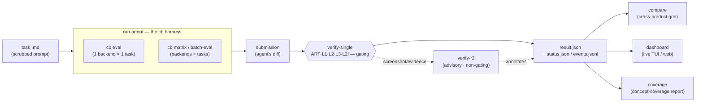
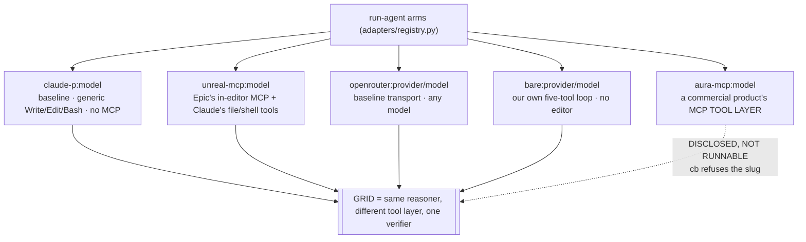
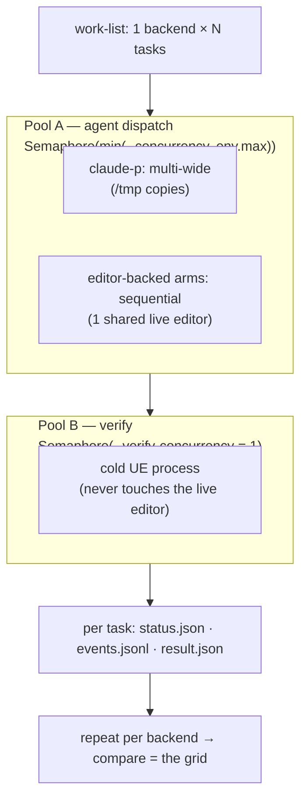
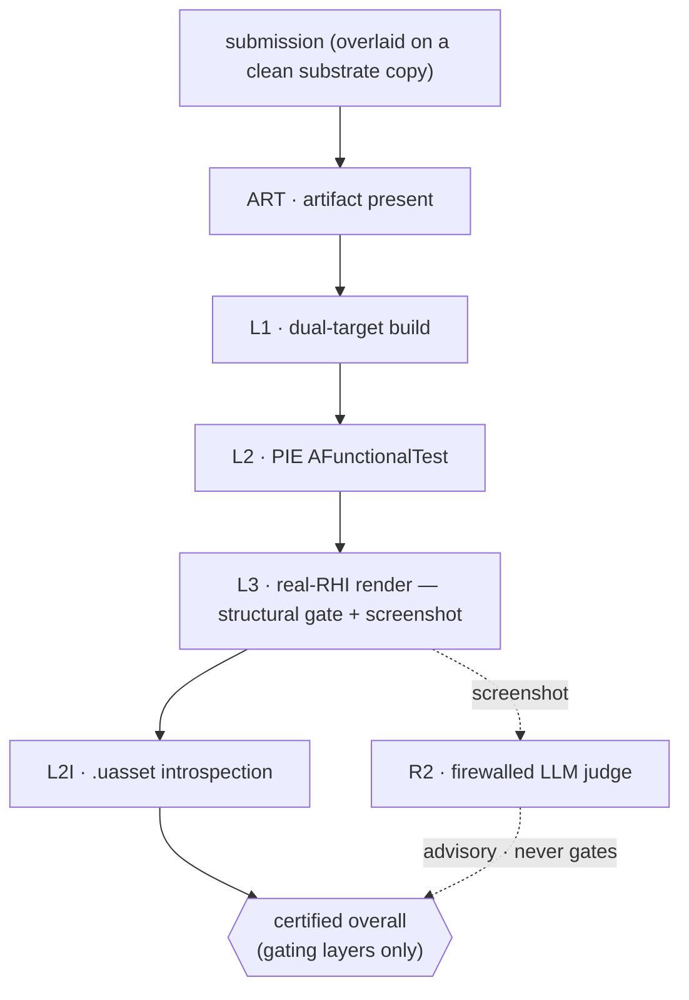

# `tools/` — CraftBench tooling map

The living index of every subsystem under `tools/`: what it is, whether it's
**canonical / advisory / utility / superseded**, and how the pieces connect.
When a tool's status here conflicts with reality, **fix this file** — it's the
map people read first. (Glossary of *terms* lives in `/CONTEXT.md`; the
repo-wide doc map is `docs/DOCS_INDEX.md`.)

Last synced: 2026-07-07.

## The pipeline (how it connects)

- **Drive** an agent (a *backend*) on a task → a submission (`run-agent`, via the `cb` launcher).
- **Grade** the submission deterministically (`verify-single`); annotate, non-gating (`verify-r2`).
- **Aggregate** many `result.json` across backends into a comparison grid (`compare`); watch live (`dashboard`); measure task-set concept coverage (`coverage`).

`cb` is the canonical CLI (`tools/run-agent/`, module `aura_rig.cb`).
Subcommands: `up / smoke / eval / bench / matrix / discriminate / batch-eval /
refgate / warm-prime / tasks / view / review / preview / lint / status /
doctor / bootstrap / clean / down`. `setup.ps1` / `setup.sh` pip-install it as a
console script; the repo-root `.\cb` / `./cb` shims work with no install at all.

## Two usage tiers

You do not need every arm to use CraftBench. The tooling supports two
independent tiers, in increasing setup cost:

1. **Grade-only (deterministic verifier).** `verify-single` alone. No agent, no
   key — you supply a submission directory and it grades. Clone-and-go: a
   fresh clone graded **22/22 reference solutions PASS on Windows + UE 5.8**
   (2026-06-21, `cb batch-eval`), including the two L2I tasks.
2. **Agent arms.** `cb eval --model claude-p:<model>`,
   `--model unreal-mcp:<model>`, `--model openrouter:<provider/model>` or
   `--model bare:<provider/model>`. Needs an LLM API key and nothing else — no
   account, no second repository.

The third arm the published measurement reports, `aura-mcp`, drives a
commercial third-party product and is **disclosed but not reproducible** from
this repository; `cb` refuses its slug immediately. See the repository README.

## Subsystem table

| Subsystem | Status | Tracked | Entry point | What it is |
|---|---|---|---|---|
| `run-agent/` | **canonical** | ✅ | `cb` (`aura_rig.cb`); `run.py`, `run_batch.py` | The agent harness, driven by the **`cb`** launcher. Drives one arm on a task (`cb eval`) or arms × tasks (`cb matrix` / `cb bench` / `cb batch-eval`). Owns the arm adapters (`adapters/registry.py`) — the per-arm `mcp_config` + `disallowed_tools` asymmetry that IS the measurement — plus live-status and port self-heal. |
| `verify-single/` | **canonical** | ✅ | `run_task.py` | The deterministic verifier. Grades one submission against one task through the gating layers + the non-gating R2 hook. Owns the git-HEAD substrate materialization + `pinning.py` provenance (the hash manifest retired 2026-07-16). |
| `verify-r2/` | **canonical (advisory)** | ✅ | (invoked by verify-single) | Firewalled LLM advisory judge — annotates a verdict, **never gates** (FR-020d). |
| `verify-stability/` | **canonical** | ✅ | `stability_check.py` | The verifier-noise gate: grades ONE fixed reference dir N times and asserts identical `submission_sha` / `overall` / per-layer counts — proves verifier flakiness (variance source *b*) is ~0. Agent stochasticity (variance *a*) is reported as a pass-rate elsewhere. |
| `compare/` | **canonical** | ✅ | `compare_products.py` | Reads many `result.json` → SC-003 per-capability taxonomy + head-to-head grid across backends. Pure aggregator (runs nothing). |
| `coverage/` | **canonical** | ✅ | `coverage.py` | Concept-coverage report. Joins each task's PRIMARY concept against the concept catalogue (`tools/coverage/concepts.csv`, folder-local) and reports how much of the in-scope high-tier catalogue the task set covers — the SC-007 / v1.0 task-set-target instrument. Pure-stdlib reader (no build, no PIE). |
| `dashboard/` | **canonical** | ✅ | `tui.py`, `serve.py` | Live fleet view (TUI + web) over what runs write to disk (`status.json` / `events.jsonl`). Read-only. |
| `scripts/` | utility | ✅ | `aura_smoke.py` | Misc operational scripts (e.g. Aura smoke check). |

### Historical / removed

`grade-trajectory/`, `run-matrix/`, `verify-batch/`, `harness-adapters/`, and
`substrate-adapters/` no longer exist. The trajectory-grading spec was never
built; the rest were superseded by `run-agent` (the `cb` harness) +
`verify-single` and removed 2026-06-04 (the `001` scaffold archived to
`runs/retired-001-scaffold-2026-06-04.tar.gz`, recoverable). See
[Superseded / retired](#superseded--retired--and-what-to-salvage) for the one
salvaged idea.

## Backends / harness model (the comparison grid)

`run-agent/adapters/registry.py` is the source of truth for the arms. They all
run through the **same `claude -p` mechanism** (`run-agent/adapters/claude_p.py`)
with the tool layer as the only variable — except `bare`, which is our own
minimal loop. That single asymmetry across arms IS the measurement.

| `--model` slug | Arm | Runnable from this repo? | What it measures |
|---|---|---|---|
| `claude-p:<model>` | **Baseline** | ✅ | Raw agent with generic `Write`/`Edit`/`Bash`, no MCP. |
| `unreal-mcp:<model>` | **Epic's in-editor MCP** | ✅ | The same reasoner given Epic's first-party MCP server on top of Claude's own file/shell tools (which stay enabled — Epic's MCP has no C++ source tool). |
| `openrouter:<provider/model>` | **Baseline (non-Anthropic)** | ✅ | The `claude-p` adapter pointed at OpenRouter's Anthropic-compatible API (needs `OPENROUTER_API_KEY`). Runs any model with zero code changes. |
| `bare:<provider/model>` | **Minimal disclosed scaffold** | ✅ | A model in our own five-tool loop over any OpenAI-compatible endpoint — no editor, so file-deliverable tasks only. |
| `aura-mcp:<model>` | **A commercial product's tool layer** | ❌ **disclosed, not reproducible** | A reasoner given **only** that product's MCP tools — measures its **tooling**, not its autonomous agent. Its dispatch and tool-denial config ship in full and are readable; the vendor plugin, services and login do not. `cb` refuses the slug in the first second. |

Run a single arm×task with `cb eval --model <slug>`; a `{model}×{task}`
leaderboard with `cb bench` / `cb matrix --model A,B,C --task <set>`. (Both
report an `aura-mcp` slug as unsupported, for the same reason `eval` does.)

**Retired arms.** `adapters/registry.py:_REMOVED_BACKENDS` is the honest record
of what once lived here — `aura-product` (the packaged client driven over CDP),
`aura-agent` / `aura-baseline` (a vendor-side autonomous loop over an HTTP/SSE
endpoint) and `aura-mcp-bridge` (a legacy external bridge loop). A slug naming
one of them gets told what it was instead of a bare "unknown backend". None of
them are part of this release, and no doc here should present them as a path.

Every diagram in this file is **mermaid rendered inline by GitHub**, not a
checked-in image. That is deliberate: the raster pair for this one was once
shipped stale, still drawing the retired `aura-product` and `aura-agent` lanes,
and a picture that contradicts the table above it is worse than no picture. With
the source as the only copy there is nothing to drift.

## Batch orchestration (`cb batch-eval` / `cb matrix`)

`cb` fans work out with a **product-neutral two-pool** model (design spec §6, §11):

- **Pool A — agent dispatch**: `Semaphore(min(--concurrency, env.max_concurrency))`.
  `claude-p` runs multi-wide in its own `/tmp` copies; `aura-*` is forced
  **sequential** (one shared live editor).
- **Pool B — verification**: `Semaphore(--verify-concurrency)` (default 1). A
  separate cold-UE process that never touches the live editor (the
  "UE-as-semaphore" model).
- Per-task failure isolation; phase machine `queued → launching → running →
  grading → done`; live `status.json` + `events.jsonl` the dashboard tails.

`cb batch-eval` runs **token-free parallel cold verifies** over reference/prior
submissions; `cb bench` / `cb matrix` produce the `{model}×{task}` leaderboard
across the runnable arms. The arm **grid** = run one arm over many tasks →
`compare` aggregates the resulting `result.json`s. (The token-spending parallel
*generation* half, `cb batch-gen`, drove the commercial product's own web UI and
is not part of this release.)

## Verify stack (`verify-single` layers)

Layers run in order; gating layers compute the certified `overall`, advisory
output annotates only. The deterministic FR-020d gate is the only thing that
flips PASS/FAIL. (See `/CONTEXT.md` for full definitions.)

| Layer | Gating | Status | What it checks |
|---|---|---|---|
| `ART` | ✅ | implemented | declared artifact exists + non-empty (floor for advisory-heavy tasks) |
| `L1` | ✅ | implemented + validated | dual-target UBT build (BOTH `<Module>Editor` + `<Module>` Game) |
| `L2` | ✅ | implemented + validated | `AFunctionalTest` in headless PIE (checkpoint schedule) |
| `L2I` | ✅ | implemented + validated | headless editor-Python `.uasset` introspection |
| `L3` | ✅ structural | implemented (registry-gating) | **real-RHI** PIE render; the fixture's **structural predicates gate**, the screenshot → R2 **visual advisory** (pixel/SSIM never gates, FR-020d). Present in the registry but **not part of the validated task set**. |
| `R2` | ❌ | implemented (advisory) | firewalled LLM advisory judge |

`L1`, `L2`, and `L2I` are implemented and validated end-to-end on Windows + UE
5.8. `L3` (`L3RenderLayer`) is implemented and registry-gating, but its pixel/SSIM
output stays advisory and it is not yet in the validated task set. `L4`/`L5` are
planned only (defined in the authoring template, not implemented in the runner).

## Superseded / retired — and what to salvage

`run-matrix/`, `verify-batch/`, `harness-adapters/`, and `substrate-adapters/`
were all superseded by `run-agent` (the `cb` harness) + `verify-single` and
**removed 2026-06-04** (run-matrix deleted; the `001` scaffold archived to
`runs/retired-001-scaffold-2026-06-04.tar.gz`, recoverable). The
`grade-trajectory/` spec was never built. The one idea `cb`'s batch path does
**not** yet have, salvaged here before deletion:

- **k-shot (`--k`)** — run each task N times for a statistical pass-rate (pass@k).
  Batch is single-attempt today; agent stochasticity is otherwise reported as a
  pass-rate via `run_batch.py --repeats` + `tools/compare`.
- (Already covered elsewhere: pinning lives in `verify-single/pinning.py`; the
  score-report contract concepts in `verify-single`; the two-pool concurrency in
  the `cb` batch path.)
